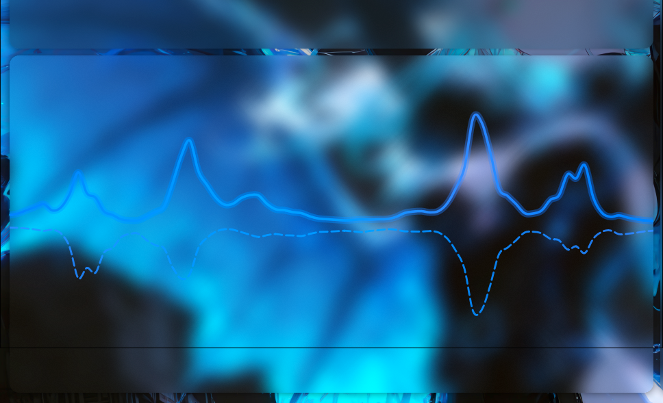
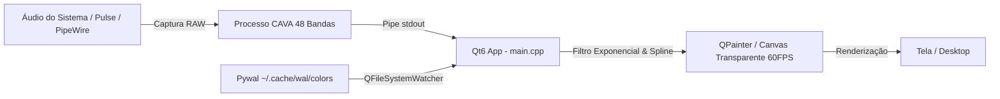

<div align="center">

# 🌊 Ondas — Audio Visualizer

**Um visualizador de áudio minimalista, suave e transparente em C++17 e Qt6, integrado ao CAVA e Pywal.**

[](https://isocpp.org/)
[](https://www.qt.io/)
[](https://github.com/karlstav/cava)
[](https://github.com/dylanaraps/pywal)
[](LICENSE)

<br/>

<p align="center">
  
</p>

</div>

---

## 📌 Sobre o Projeto

**Ondas** é um visualizador de áudio para Linux desenvolvido em **C++17** com **Qt6**. Projetado para ser leve, fluido e esteticamente impecável, ele captura o áudio do sistema em tempo real através do **CAVA** e renderiza ondas senoidais suaves com interpolação *Cubic Spline*, efeito de brilho (*ambient bloom halo*) e sincronização automática com as cores do seu wallpaper via **Pywal**.

Perfeito para setups minimalistas (*unixporn*), desktops personalizados (i3, bspwm, Hyprland, Sway, KDE, GNOME) ou como overlay flutuante na sua área de trabalho.

---

## ✨ Principais Recursos

- 🌊 **Ondas Suaves & Orgânicas**: Interpolação matemática *Cubic Spline* com decaimento exponencial estilo *Monstercat*, garantindo movimentação limpa sem saltos bruscos.
- 🪟 **Canvas 100% Transparente**: Janela sem bordas (*frameless*) e fundo translúcido para integrar perfeitamente ao seu desktop ou wallpaper.
- 🎨 **Sincronização Dinâmica com Pywal**: Lê automaticamente as cores de `~/.cache/wal/colors` com recarregamento a quente (*hot-reload*) via `QFileSystemWatcher`. Se o Pywal não estiver ativo, utiliza uma paleta Neon vibrante (Cyan / Pink / Gold).
- ⚡ **Alta Performance (60 FPS)**: Renderização 2D acelerada com *antialiasing* nativo do Qt6 e consumo mínimo de recursos.
- 🎵 **Captura de Áudio via CAVA**: 48 bandas de frequência com auto-sensibilidade e processamento em pipeline direto.
- 💫 **Camadas Visuais Dinâmicas**:
  - *Main Wave*: Linha principal com degradê gradiente e efeito *ambient glow*.
  - *Echo Ribbon*: Linha tracejada secundária que adiciona profundidade e harmonia acústica.

---

## 🛠️ Tecnologias Utilizadas

| Componente | Tecnologia | Finalidade |
| :--- | :--- | :--- |
| **Linguagem** | C++17 | Performance e controle de memória |
| **Framework GUI** | Qt6 (`QtWidgets`, `QtGui`, `QtCore`) | Janela translúcida e desenho vetorial (`QPainter`) |
| **Processamento de Áudio** | [CAVA](https://github.com/karlstav/cava) | Análise de espectro de áudio bruto (*raw PCM FFT*) |
| **Theming** | [Pywal](https://github.com/dylanaraps/pywal) | Extração e sincronização automática de cores do wallpaper |
| **Build System** | Bash + `moc` + `g++` / `pkg-config` | Compilação rápida e sem complexidade |

---

## 📋 Pré-requisitos e Dependências

Certifique-se de ter instalado o compilador C++, o **Qt6**, o **CAVA** e as ferramentas de build:

### 📦 Arch Linux / Manjaro:
```bash
sudo pacman -S base-devel qt6-base cava
# Opcional (para sincronização de cores com wallpaper):
sudo pacman -S python-pywal
```

### 📦 Ubuntu / Debian (22.04+):
```bash
sudo apt update
sudo apt install build-essential qt6-base-dev qt6-base-dev-tools cava libgl1-mesa-dev
# Opcional:
sudo apt install python3-pip && pip install pywal
```

### 📦 Fedora:
```bash
sudo dnf install gcc-c++ qt6-qtbase-devel cava
# Opcional:
sudo dnf install python3-pywal
```

---

## 🚀 Como Compilar e Executar

### 1. Clonar o Repositório
```bash
git clone https://github.com/seu-usuario/ondas.git
cd ondas
```

### 2. Compilar e Rodar com o Script de Build
O script `build.sh` executa o MOC do Qt6, compila o código e inicia a aplicação:
```bash
chmod +x build.sh
./build.sh
```

### 3. (Opcional) Instalar como Comando Global
Você pode criar um link ou mover o script/executável para o seu `$PATH` (como `~/.local/bin/ondas`):
```bash
mkdir -p ~/.local/bin
cat << 'EOF' > ~/.local/bin/ondas
#!/usr/bin/env bash
exec /caminho/para/o/projeto/main "$@"
EOF
chmod +x ~/.local/bin/ondas
```
Agora basta digitar no terminal:
```bash
ondas
```

---

## 🎮 Controles e Atalhos

| Tecla / Atalho | Ação |
| :--- | :--- |
| <kbd>Q</kbd> | Fechar o visualizador |
| <kbd>Esc</kbd> | Fechar o visualizador |
| <kbd>Ctrl</kbd> + <kbd>C</kbd> | Encerrar no terminal |

---

## 📂 Estrutura do Projeto

```
ondas/
├── main.cpp          # Código-fonte principal (Lógica Qt6 + CAVA + Pywal)
├── build.sh          # Script de automação de compilação C++17 e MOC
├── image.png         # Screenshot de demonstração do visualizador
├── .vscode/          # Configurações de tasks e C/C++ IntelliSense
└── README.md         # Documentação completa do projeto
```

---

## ⚙️ Como Funciona por Baixo dos Panos



1. **CAVA**: É inicializado em segundo plano com um arquivo de configuração temporário, gerando 48 bandas de frequência normalizadas em ASCII via stdout.
2. **Buffer & Parser**: O Qt lê a saída contínua do CAVA em tempo real.
3. **Decaimento Monstercat**: Os valores das bandas passam por uma suavização matemática exponencial para evitar oscilações abruptas.
4. **Cubic Spline Curves**: Os pontos normalizados são conectados através de curvas cúbicas de Bézier com *Ambient Glow* e *Echo Ribbons*.
5. **Pywal Watcher**: O `QFileSystemWatcher` monitora alterações nas cores do sistema, aplicando transições de paleta instantaneamente.

---

## 🤝 Contribuições

Contribuições, sugestões e relatórios de bugs são super bem-vindos!
Sinta-se à vontade para abrir uma *Issue* ou enviar um *Pull Request*.

1. Faça um Fork do projeto
2. Crie uma branch para sua funcionalidade (`git checkout -b feature/minha-feature`)
3. Faça o commit das alterações (`git commit -m 'feat: Adiciona nova funcionalidade'`)
4. Envie para o branch (`git push origin feature/minha-feature`)
5. Abra um Pull Request

---

## 📝 Licença

Distribuído sob a licença **MIT**. Veja `LICENSE` para mais informações.

---

<div align="center">
  Feito com 💙, C++ e Qt6 para amantes de Linux & Audiófilos.
</div>
